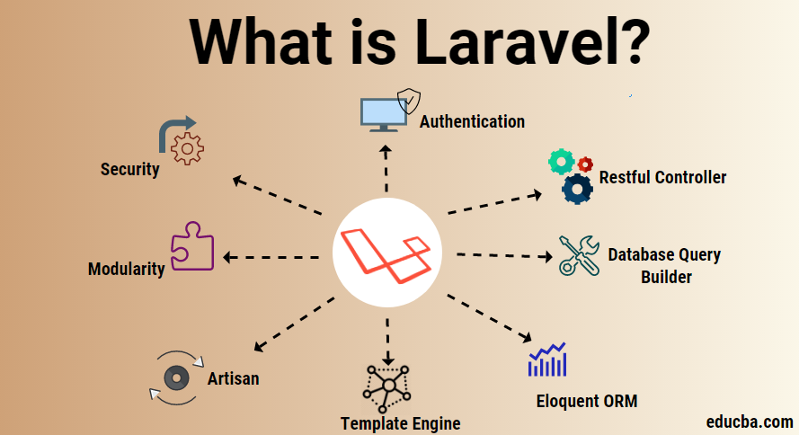

# Curso laravel

## Configuración del entorno de trabajo

Para comenzar a desarrollar proyecto con laravel se necesitan tener instalado los siguiente programas y/o librerías

* php en la versión 7.2 en adelante
* Composer
* nodejs y npm

### ¿Qúe es composer?

Composer es un sistema de gestión de paquetes para programar en  PHP el cual provee los formatos estándar necesarios para manejar  dependencias y librerías de PHP. 

### ¿Qué son NodeJS y NPM?

Nodejs es toda una plataforma de desarrollo que nos permite crear software para distintas plataformas, principalemente web y desktop (aplicaciones de escritorio), como su nombre lo indica, funciona con js, es decir, javascript, un lenguaje que en los últimos años ha adquirido bastente popularidad por su versatilidad.

Por otra parte npm es un gestor de paquetes de node, *NPM* significa *node package manager*.

Laravel hace uso de npm ya que el framework funciona con paquetes de php y con paquetes de javascript, por ello es necesario instalarlo.

### ¿Qué son las bibliotecas?

Una biblioteca es un conjunto de elementos (funciones, clases, constantes, variables globales, etc.) que es posible utilizar en programa para facilitar la implementación del mismo.

Por ejemplo, si estoy haciendo un programa  que haga uso de operaciones con matrices, no me voy a poner a programar cada una de las operaciones con matrices sino que haré uso del código que alguién más ya haya hecho (biblioteca) para resolver mi problema.

### ¿Qué es un API?

API significa "Application programming interface", que se puede traducir como interfaz de para programación de aplicaciones. 

El API es un conjunto de definiciones y protocolos que se utiliza para desarrollar e integrar el software de las aplicaciones: sirviendo de interfaz entre programas diferentes de la misma manera en  que la interfaz de usuario facilita la interacción humano-software.

Las API son valiosas, ante todo, porque **permiten hacer uso de  funciones ya existentes en otro software (o de la infraestructura ya  existente en otras plataformas) para no estar reinventando la rueda  constantemente**, reutilizando así código que se sabe que está probado y que funciona correctamente.

### Qué es un framework?

Un framework es un conjunto de herramientas que facilitan el desarrollo de software. Puede incluir bibliotecas y APIs, e inclusive puede dejarnos definir nuestras propias APIs. 

Además de bibliotecas o APIs, un framework puede incluir herramientas de depuración, protipado, configuración y hasta para hacer pruebas o los famosos "deployment", o puesta en  "Producción" de nuestro sotfware construido con ayuda del framework.

### ¿Qué es laravel?

Laravel es un framework de php para el desarrollo de sitios web y servicios web

**Tarea para el lector: Buscar a que se refiere con servicio web**

Laravel es uno de los frameworks más elegantes, potentes y sencillos de usar, es por ello que en la industria se solicita mucho.

Hay que tener en cuenta que laravel funciona siguiendo la arquitectura MVC por lo que aprenderla nos ayudará.

### Frameworks similares

A mi parecer los frameworks que son compentencia de laravel son  **Django**, con un mercado un poco vacilante a la hora de realizar sitios web en dicho framework, en mi opinión debido a que poner montar un sitio con Django cuesta más dinero ya que requiere de tener un ambiente totalmente completo (un sistema operativo como tal, por ejemplo Linux), en cambio con laravel es más barato ya que se puede hacer uso del concepto de **shared hosts**

**Tarea para el lector: Investigar que son los shared hosts**