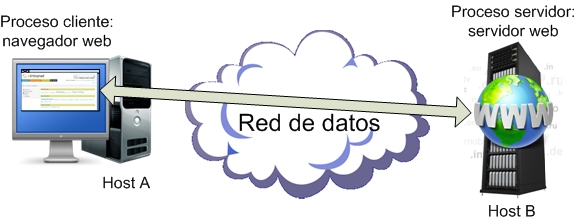

# Curso laravel

### Arquitectura cliente servidor (C/S)

La **arquitectura cliente-servidor** es un modelo de diseño de software en el que las tareas se reparten entre los proveedores de recursos o servicios, llamados *servidores*, y los demandantes, llamados *clientes*. Un cliente realiza peticiones a otro programa, el servidor, quien le da respuesta.

La separación entre cliente y servidor es una separación de tipo lógico, donde el servidor no se ejecuta necesariamente sobre una sola máquina ni es necesariamente un solo programa. Los tipos específicos de servidores incluyen los servidores web, los servidores de archivo, los servidores del correo, etc. Mientras que sus propósitos varían de unos servicios a otros, la arquitectura básica seguirá siendo la misma. 

### Protocolo http y https 

El **Protocolo** de transferencia de hipertexto (en inglés, Hypertext Transfer Protocol, abreviado **HTTP**) es el **protocolo** de comunicación que permite las transferencias de información en la World Wide Web.

HTTP es un *protocolo sin estado*, es decir, no guarda ninguna información sobre conexiones anteriores. El desarrollo de aplicaciones web necesita frecuentemente mantener estado. Para esto se usan las cookies, que es información que un servidor puede almacenar en el sistema cliente. 

#### Métodos de petición

HTTP define una serie predefinida de métodos de petición (algunas veces referido como "verbos") que pueden utilizarse. Cada método indica la acción que desea que se efectúe sobre el recurso identificado.

##### Método GET

El método GET solicita una representación del recurso especificado. Las  solicitudes que usan GET solo deben recuperar datos y no deben tener  ningún otro efecto.

##### Método POST

Envía los datos para que sean procesados por el recurso identificado.  Los datos se incluirán en el cuerpo de la petición. Esto puede resultar  en la creación de un nuevo recurso o de las actualizaciones de los  recursos existentes o ambas cosas.

*En resumen, el método get me sirve para recuperar datos del servidor, mientras que el método post me sirve para enviar datos al servidor con la finalidad de que estos sean procesados*. 

*Post envía los datos en segundo plano, mientras que get, deja ver los datos que le envíamos al servidor*.

**Existen otros método que se abordarán en la sección de rutas del este curso, como delete, update, etc.**

#### Códigos de respuesta

El código de respuesta o retorno es un número que indica que ha  pasado con la petición. El resto del contenido de la respuesta dependerá del valor de este código. El sistema es flexible y de hecho la lista de códigos ha ido aumentando para así adaptarse a los cambios e  identificar nuevas situaciones. Cada código tiene un significado concreto. Sin embargo el número de los  códigos están elegidos de tal forma que según si pertenece a una centena u otra se pueda identificar el tipo de respuesta que ha dado el  servidor:

- Códigos con formato 1xx: Respuestas informativas. Indica que la petición ha sido recibida y se está procesando.
- Códigos con formato 2xx: Respuestas correctas. Indica que la petición ha sido procesada correctamente.
- Códigos con formato 3xx: Respuestas de redirección. Indica que el  cliente necesita realizar más acciones para finalizar la petición.
- Códigos con formato 4xx: Errores causados por el cliente. Indica que ha habido un error en el procesado de la petición a causa de que el  cliente ha hecho algo mal.
- Códigos con formato 5xx: Errores causados por el servidor. Indica  que ha habido un error en el procesado de la petición a causa de un  fallo en el servidor.

Lo códigos más comunes son

* `404` el cual nos indica que la página que  solicitamos no se encuentra en el servidor.
* `504` significa que por alguna razón no tenemos acceso a la página que intentamos acceder.

### MVC (Modelo vista controlador)

Es un patrón de arquitectura de las aplicaciones software. De manera genérica, los componentes de MVC se podrían definir como sigue:

* **El Modelo**: Es la representación de la información con la cual el sistema opera, por lo tanto gestiona todos los accesos a dicha información, tanto consultas como actualizaciones, implementando también los privilegios de acceso que se hayan descrito en las especificaciones de la aplicación (lógica de negocio). 

  Envía a la 'vista' aquella parte de la información que en cada momento se le solicita para que sea mostrada (típicamente a un usuario). Las peticiones de acceso o manipulación de información llegan al 'modelo' a través del 'controlador'.

  

* **El Controlador**: Responde a eventos (usualmente acciones del usuario) e invoca peticiones al 'modelo' cuando se hace alguna solicitud sobre la información (por ejemplo, editar un documento o un registro en una base de datos). 

  También puede enviar comandos a su 'vista' asociada si se solicita un cambio en la forma en que se presenta el 'modelo' (por ejemplo, desplazamiento o scroll por un documento o por los diferentes registros de una base de datos), por tanto se podría decir que el 'controlador' hace de intermediario entre la 'vista' y el 'modelo' (véase Middleware).

  

* **La Vista**: Presenta el 'modelo' (información y lógica de negocio) en un formato adecuado para interactuar (usualmente la interfaz de usuario), por tanto requiere de dicho 'modelo' la información que debe representar como salida.

  

La siguiente imagen es una representación del modelo vista controlador.

**Otras arquitecturas de software que se están empleando en la actualidad son : MVP y MVVM, las cuales podrían considerarse como derivaciones o mutacion de MVC**